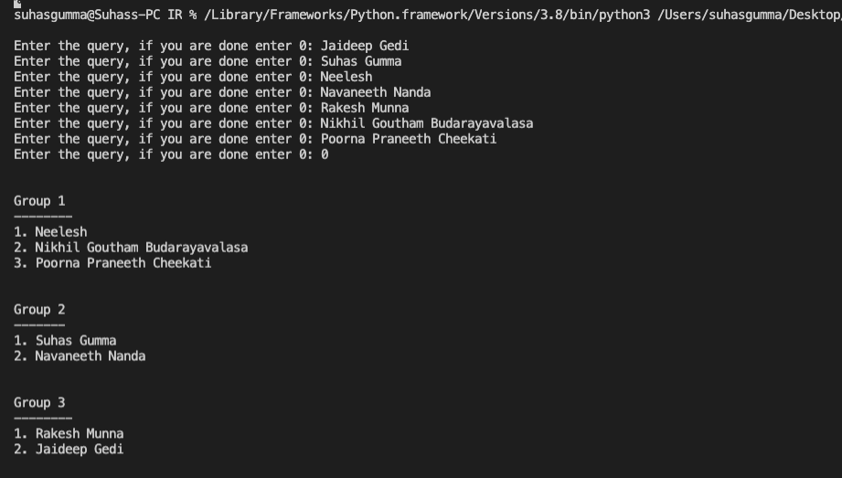

# Grouper-IR
Divides the given set of Names into groups using accessible Digital footprints. 

__Used Libraries__

1. googlesearch
2. BeautifulSoup
3. requests
4. NLTK
5. numpy
6. lsa
7. sklearn

__1. Obtaining Data of Given Names__
* Get the top 10 links related to the given name using googlesearch Library.

* Get the text using BeautifulSoup Library.

* Pre- process all the text( Removing all stopwords, Apply stemming, tokenize) using NLTK library.

__2. Forming TF_IDF matrix for Each Name__
* Buid a Tf-Idf matrix for each name from the pre-processed text.

__3.Create LSI Corpus and Cluster them__

* Create LSI corpus using Tf-Idf matrix and cluster them using K-means Algorithm.

__DEMO__

